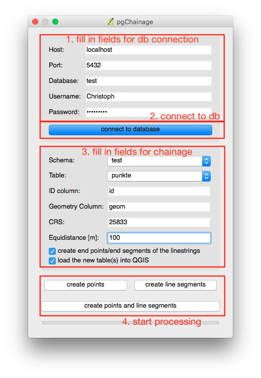

# pgChainage
QGIS-plugin for chainage linestrings of a table directly in PostgreSQL/PostGIS

## Goal of the project
This plugin converts a layer of line strings into a chain of points and or equidistance linestrings. The main work takes place directly in the PostgreSQL-/PostGIS-database, i.e. big tables have not to be imported into QGIS before and during processing.

## Usage
1. Fill in the parameters for establishing a connection to the database. The DBMS has to be PostgreSQL, and the extension PostGIS must created before starting the processing.<br>
2. Press the "connect to database"-button. A Message Bar above the map window will appear and tells the user, whether a connection could established or not.<br>
3. Choose the table (and schema), which should be used for the chainage. The table must have a geometry column of the type LINESTRING. Then fill in the other fields. The CRS can differ from the CRS of the choosed geometry. The PlugIn calls the PostGIS-function ST_Transform(...) to project the geometries into the specified CRS; to state the CRS of the geometry-column is not necessary. It is recommended to specify a metric CRS. If the checkbox "calculate last point/last substring of lines" is checked, the endpoint and/or the last substring of each line will be calculated by ignoring the specified equidistance (just for the end-geometries) and inserted into the database.<br>
4. Their are three buttons to start the processing. The button "create points" just creates points along each line. The button "create substrings" just creates lines with the same specified distance from the input layer. The button "create points & substrings" starts both processings.

<br>
A new schema called <i>pgchainage</i> will be created and in this schema the chainaged layer(s) will be stored. The new layer(s) will be named like "name_of_linestring_layer"_chainage/"name_of_linestring_layer"_substring<b>If a table with the same name already exists, the plugin will throw an exception.</b> The plugin will also throw an exception, if the user inserts names for the id- and/or geom-column, that do not exists in the database.
<br> <br>
<b>Important:</b>
<br>
The plugin has been developed and tested using PostgreSQL 10 and PostGIS 2.4. Maybe it will not work with older versions of the named products, e.g. the chainage is realized by using the PostGIS-function ST_LineInterpolatePoint, which has the name ST_line_interpolate_point e.g. in PostGIS 2.1 (look at line 73 in the file <i>db.py</i>):
```python
chainage_sql = ("DO $chainage$\n" +
"DECLARE\n" +
"current_fractional double precision := 0.0;\n" +
"current_number_of_point integer := 1;\n" +
"i record;\n" +
"BEGIN\n" +
"FOR i IN SELECT " + id_column + " as id_column, st_transform(" + geom_column + ", " + crs + ") as geom, st_length(st_transform(" + geom_column + ", " + crs + ")) as line_length FROM " + source_schema + "." + source_table + " WHERE " + id_column + " = " + str(id) + " LOOP\n" +
"current_fractional := 0.0;\n" +
"WHILE current_fractional <= (1.0)::double precision LOOP\n" +
"INSERT INTO " + target_schema + "." + target_table + "(old_id, geom, number_on_line)\n" +
"VALUES(i.id_column, ST_LineInterpolatePoint(i.geom, current_fractional), current_number_of_point);\n" +
"current_fractional := current_fractional + (" + str(equidistance) + " / i.line_length);\n" +
"current_number_of_point := current_number_of_point + 1;\n" +
"END LOOP;\n" +
"END LOOP;\n" +
"END $chainage$")
```
## Additional information:
Source of the icon: Webalys - Kameleon Icons (http://www.kameleon.pics)
