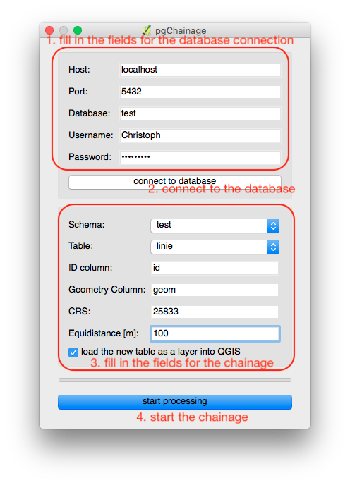

# pgChainage
QGIS-plugin for chainage linestrings of a table directly in PostgreSQL/PostGIS

## Goal of the project
This plugin converts a layer of line strings into a chain of points. The main work takes place directly in the PostgreSQL-/PostGIS-database, i.e. big tables have not to be imported into QGIS before and during processing.

## Usage
Usage: Just insert the parameters for the connection to your database (and connect with the database), than choose the schema and table (note: all available schemata and tables will be displayed), fill in the names of the ID- and geom-column, choose a CRS for the resulting point layer (a metric-CRS is recommended) and fill in an equidistance (if you choosed a metric-CRS, this values is in meters) - and start the processing.

<br> <br>
<b>Important:</b>
<br>
The plugin has been developed and tested using PostgreSQL 10 and PostGIS 2.4. Maybe it will not work with older versions of the named products, e.g. the chainage is realized by using the PostGIS-function ST_LineInterpolatePoint, which has the name ST_line_interpolate_point e.g. in PostGIS 2.1 (look at line 73 in the file <i>db.py</i>):
```python
chainage_sql = ("DO $chainage$\n" +
"DECLARE\n" +
"current_fractional double precision := 0.0;\n" +
"current_number_of_point integer := 1;\n" +
"i record;\n" +
"BEGIN\n" +
"FOR i IN SELECT " + id_column + " as id_column, st_transform(" + geom_column + ", " + crs + ") as geom, st_length(st_transform(" + geom_column + ", " + crs + ")) as line_length FROM " + source_schema + "." + source_table + " WHERE " + id_column + " = " + str(id) + " LOOP\n" +
"current_fractional := 0.0;\n" +
"WHILE current_fractional <= (1.0)::double precision LOOP\n" +
"INSERT INTO " + target_schema + "." + target_table + "(old_id, geom, number_on_line)\n" +
"VALUES(i.id_column, ST_LineInterpolatePoint(i.geom, current_fractional), current_number_of_point);\n" +
"current_fractional := current_fractional + (" + str(equidistance) + " / i.line_length);\n" +
"current_number_of_point := current_number_of_point + 1;\n" +
"END LOOP;\n" +
"END LOOP;\n" +
"END $chainage$")
```
## Additional information:
Source of the icon: Webalys - Kameleon Icons (http://www.kameleon.pics)
